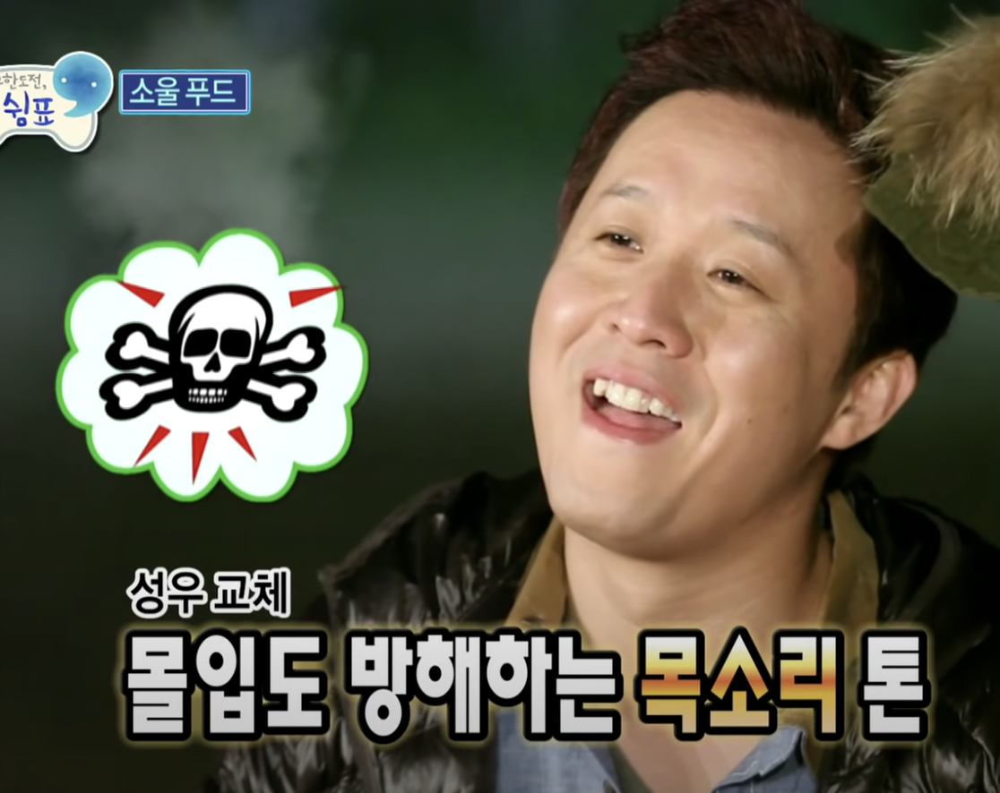

# Infinite Challenge [South Korea]
"Challenge is Infinite". Infinite Challenge is a South Korean television entertainment program, distributed and syndicated by MBC.

> Infinite Challenge is recognized as the first "Real-Variety" show in Korean television history. The program is largely unscripted, filmed in almost-secrecy and followed a similar format of challenge-based reality television programs. The challenges are often absurd or impossible to achieve, so the program takes on the satirical comedy aspect of a variety show rather than a standard reality or competition program. In earlier episodes, the show's six hosts and staff would continuously proclaim that, in order to achieve its comedic purposes, the program had to be "3-D": Dirty, Dangerous, and Difficult.[14] It gives people fun to try things that seem impossible.
[Wikipedia](https://en.wikipedia.org/wiki/Infinite_Challenge)

# Project Overview
## Skulls (i.e. Skullmark)

[_Captured from MBC TV Show 'Infinite Challenge 무한도전'_]

One of the unique characteristics of this show is their visual effects and video editing. It is famous for its unique skull mark, throughout the airing of the show from the year 2005-2018.
The editors of the TV show uses this visual effect, attached near to the member's face/body, to express the person's sudden embarrassment or sometimes humiliation.

## Objective

Our goal was to simply count how many skull marks each member were attached, throughout the entire airing period, and visualise the processed data.
We wanted to use Facial Recognition, Object Detection and Data Visualisation Tools to achieve our objectives.

# Project Description
## Data Pipeline

   1. Skull Detector processes the episode video file & saves screenshots into a dir with the same name as video file (i.e. if video is named `ep120.mp4` then the directory that contains screenshots of skulls detected would be dir `ep120/`)
        * Also, skull detector script will save a csv file that contains the necessary information
            * When skull is detected (timestamp)
            * No. of skull detected in one frame (no_skull)
            * Coordinates of the skull (boxes)
   1. Main script (facial_recognition model) will iterate the images in the directory and recognise which person is detected in the scene where skull is appeared. 
        * IF multiple people is detected with the skull, we will use the coordinates of the skull and the detected member's faces that are already logged in the CSV file, to find the person that are located closest to the skull (estimated to be the person who is being burned)
    
## Phase 1: Skull Detection
## Phase 2: Facial Recognition

Once phase 1 completes collecting images where skull is detected from the episode file, Face recognition will come in to play 
_(above image is the sample result image created by our python script)_

We used `Azure Cognitive Services` from MS, instead of using local facial_recognition model. This was because using cloud services allowed faster processing speed, and it provided significantly higher matching accuracy compared to using OpenCv-Face Recognition Model.

For each image saved from phase 2, recognised face with boundaries will be labeled in the image and uploaded automatically, together with the CSV results into our Google Drive for better
analysis.

## Phase 3: Analysis & Estimation
## *Batch Processing (Discontinued)*
