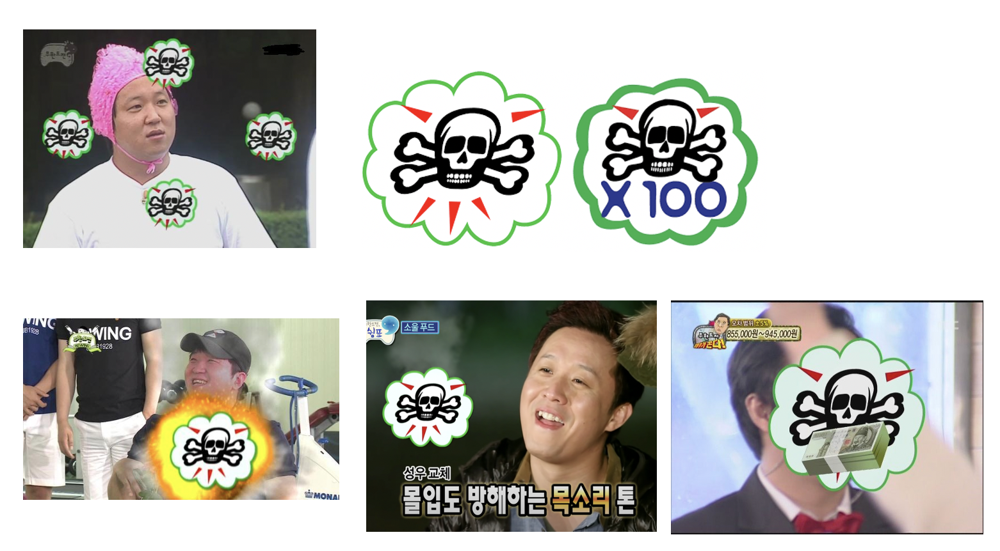
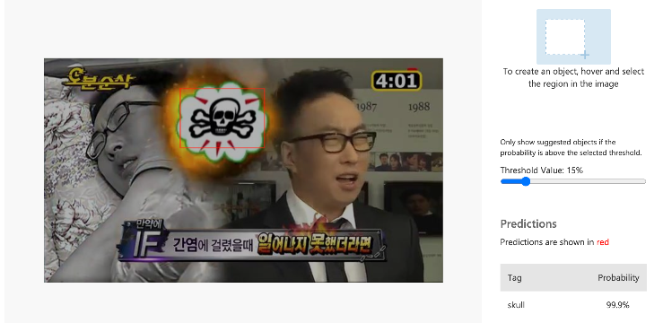
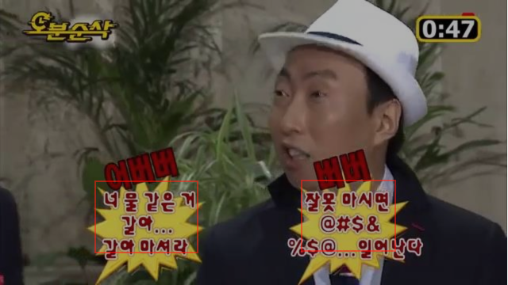
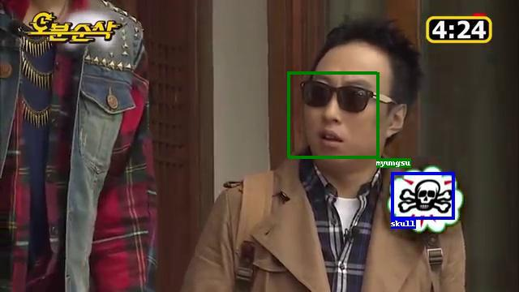
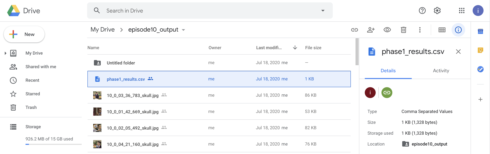

# Infinite Challenge [South Korea]
"Challenge is Infinite". Infinite Challenge is a South Korean television entertainment program, distributed and syndicated by MBC.

> Infinite Challenge is recognized as the first "Real-Variety" show in Korean television history. The program is largely unscripted, filmed in almost-secrecy and followed a similar format of challenge-based reality television programs. The challenges are often absurd or impossible to achieve, so the program takes on the satirical comedy aspect of a variety show rather than a standard reality or competition program. In earlier episodes, the show's six hosts and staff would continuously proclaim that, in order to achieve its comedic purposes, the program had to be "3-D": Dirty, Dangerous, and Difficult.[14] It gives people fun to try things that seem impossible.
[Wikipedia](https://en.wikipedia.org/wiki/Infinite_Challenge)

# Project Overview
## Skulls (i.e. Skullmark)

[_Captured from MBC TV Show 'Infinite Challenge 무한도전'_]

One of the unique characteristics of Infinite Challenge is their visual effects and video editing. It is famous for 
its unique **skull mark**, a visual effect which the editors of the show place near a the member's face/body, to express
a member's sudden embarrassment or sometimes humiliation during interactions between the members and guests. 

## Objective
Our goal is to count the number of times each member was marked with a **skull mark** throughout the entire series, and 
visualise the processed data.

## Methodology
To automate the process of recording each instance of a member being marked with a **skull mark**, we use Facial 
Detection, Facial Recognition, Object Detection and Data Visualisation Tools. 

# Project Description
## Data Pipeline

1. In order to reduce the number of frames we need to process for each episode, we first use object detection to find frames which contain **skull marks** and record relevant data such as:
	* Timestamp of the frame **skulls mark(s)** were detected in
	* Location of the bounding boxes of each **skull mark** detected.
2. We then process these filtered frames and
	1. locate each face in the frame, and
	2. identify the faces that were detected.
	Once again, we record relevant data such as the location of the bounding boxes of each face detected.
3. Using the data from previous 2 steps, we can now attempt to determine which member was marked in frames which contain both **skull mark(s)** and identified face(s), and record the results onto a database.
4. Once we have processed the episodes, we can visualize the data using data in the database using data visualisation software.

# Implementation
## Phase 1: Skull Detection

In Phase 1 of the data pipeline, we first download an episode of the show and sample frames within the video using a specified sample period (in milliseconds). A higher sample period means more frames are skipped, which leads to faster processing speed but with a trade-off of an increased chance of missing frames containing a **skull mark**.
We used a sample period of `1300` ms, which gives us a good balanced between the two aforementioned factors.
Another reason we use object detection first is to reduce the number of frames we need to process using facial detection and recognition.

For each frame sampled, the script detects whether a **skull mark** is present. 
Rather than processing each frame locally, we chose to use `Custom Vision` from `Azure Cognitive Services` to train a custom **skull mark** detection model for three reasons:
 * `Custom Vision` was significantly more accurate than our locally trained model, and 
 *  Cloud processing allowed our script to be run on lower spec systems, allowing us to reduce the bottlenecked caused by our own hardware limitations.
detection scripts in terms of speed, and
 * The results of previous predictions are readily available via online portal for manual interpretation and reusing as training data to improve our model.

Notably, we discovered that our previous model frequently confuses text blocks with special effects with **skulls marks**. Therefore, we trained our model with dummy labels representing typical types of text blocks in _Infinite Challenge_ episodes to achieve better performance.

In the final stage of Phase 1, the script caches all the sampled frames which had **skull mark(s)** detected, along with the location of the bounding boxes in a CSV file, for later processing in the pipeline.

## Phase 2: Facial Recognition

In Phase 2 of the pipeline, facial detection and facial recognition will come in to play 
_(above image is the sample result image created by our python script)_

Once again, we used `Azure Cognitive Services` from MS, instead of using processing the images locally. This was because using cloud services allows for faster and more accurate detection and recognition which allowed us to not be bottlenecked by hardware limitation on the computers we own.

For each image saved from phase 2, recognised faces are labeled in the image and uploaded automatically, together with the results saved onto a CSV file, into our Google Drive for manual review.

## Phase 3: Analysis & Estimation
In Phase 3 of the pipeline, using the results of the previous two phases, we attempt to determine which member was marked with a **skull mark**.

In the simplest case, in a frame with a single face, it is straight-forward to assume that the identified member is the **skull marked** member.

However, in cases with multiple possible faces, multiple **skull marks**, or both, we need to estimate which member was marked. The simple algorithm we use to estimate the marked member is as follows:
1. Calculate the coordinate of the centroid of each **skull mark's** bounding box
2. Calculate the average coordinate of the **skull mark** centroids
3. Let the closest member to the average **skull mark** be None, and the closest distance to the mark be `infinity`.
4. For each detected face:
	1. Calculate the coordinate of the centroid of the face's bounding box.
	2. Calculate the euclidean distance between the average **skull mark** centroid and the face centroid
	3. If the distance is shorter than the current closest distance, \
	let the closest member be the name of the identified face, and the distance be the distance calulated earlier.\
	Else if the distance is equal, prioritize an identified face over a face whose name is `unknown`.
5. Return the name of the closest member
	
This is done for each frame which has had both **skull mark(s)** and faces, and the results are uploaded to a database where is can be used later for data visualization.

## *Batch Processing (Discontinued)*
